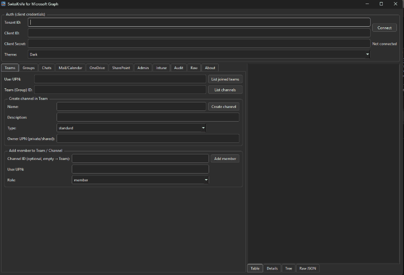

# 🗡️ SwissKnife for Microsoft Graph  
*A clean, fast, cross-platform Microsoft Graph desktop client for IT admins.*


---

## 🎬 UI Preview



---

## 🚀 Overview

SwissKnife is a lightweight, cross-platform desktop client for Microsoft Graph API — designed for IT administrators who prefer clean UI buttons instead of bulky PowerShell scripts.

It provides instant access to Teams, OneDrive, SharePoint, Groups, Admin, Intune, Audit logs, and raw Graph queries — all in one place.

---

## ✨ Features

### 🛠 Core
- Client Credentials authentication (Azure App Registration)
- Dark/Light themes  
- Multi-pane result display: **Table / Details / Tree / Raw JSON**
- JSON syntax highlighting  
- Works on **Windows, macOS, Linux**

---

## 👥 Teams & Groups
- List user’s joined Teams  
- List channels  
- Create Standard / Private / Shared channels  
- Add members or owners  
- Create Microsoft 365 Groups  
- Add owners / members  
- Convert Groups → Teams ("Teamify")  

---

## 💬 Chats
- List user chats  
- View chat messages  
- View deleted messages (if API permits)
- Add chat members  
- Create new group chats  

---

## 📁 OneDrive
- List root folder  
- Upload / download files  
- App-only permissions supported  
- Cross-user file operations  

---

## 🏢 SharePoint
- Site search  
- List site drives  
- Upload / download files  

---

## 👤 Admin (Entra ID)
- User info  
- Block / unblock users

(Coming soon)
- Licensing

---

## 📱 Intune
- Managed device list  
- Device info  
- Wipe & retire  

---

## 📊 Audit
- Sign-in logs  
- Directory audit logs  

---

## 🧪 Raw Graph Editor
A built-in Graph API playground with:

- GET / POST / PATCH / PUT / DELETE  
- JSON body  
- Example queries  
- Full response inspector  

---

## 🔧 Installation

### **Windows**
Download: `SwissKnifeGraph.exe`

### **macOS**
Download: `SwissKnifeGraph-macOS.zip`

If the app is blocked:

```bash
xattr -dr com.apple.quarantine SwissKnifeGraph.app
````

### **Linux**

```bash
chmod +x SwissKnifeGraph.sh
./SwissKnifeGraph.sh
```

---

## 🛠 Build From Source

### Requirements

```
pyside6
requests
msal
```

### Run

```bash
pip install -r requirements.txt
python gui_qt.py
```

---

## 🔐 Azure App Registration

You will need:

* Tenant ID
* Client ID
* Client Secret

## 🔎 Minimal Permissions (Core-only)

If you want **only basic features**, this reduced list will work:

- Directory.Read.All
- User.Read.All
- Group.ReadWrite.All
- Team.ReadWrite.All
- Files.ReadWrite.All
- Sites.ReadWrite.All
- AuditLog.Read.All

This excludes: Chats, Calendar, Mail, Intune, Wipe/Retire devices, Channel membership.


## 🔐 Required Microsoft Graph Permissions (Application)

SwissKnife requires the following Microsoft Graph **Application** permissions (not Delegated!)  
to enable full functionality across Teams, OneDrive, SharePoint, Groups, Intune, Chat, Audit Logs, and Admin operations.

| Permission | Category | Why It's Needed |
|-----------|----------|-----------------|
| **Directory.Read.All** | Directory | Read users, groups, Teams, directory objects |
| **Directory.ReadWrite.All** | Directory | Update directory objects (required for Teamify & ownership updates) |
| **User.Read.All** | Users | Read user profiles across the tenant |
| **User.ReadWrite.All** | Users | Modify user objects (e.g., block/unblock users) |
| **Group.ReadWrite.All** | Groups | Create & manage M365 Groups, add owners/members |
| **Organization.Read.All** | Tenant Info | Retrieve organization details after authentication |
| **Team.ReadWrite.All** | Teams | Manage Teams, channels, members |
| **Team.Create** | Teams | Create Teams from Groups (“Teamify”) |
| **TeamMember.Read.All** | Teams | List members of Teams |
| **TeamMember.ReadWrite.All** | Teams | Add/remove members (owner/member roles) |
| **Channel.Create** | Teams → Channels | Create standard / private / shared channels |
| **ChannelMember.ReadWrite.All** | Teams → Channels | Add/remove channel members |
| **Files.ReadWrite.All** | OneDrive / SharePoint | Upload, download, copy files across any SharePoint/OneDrive |
| **Sites.ReadWrite.All** | SharePoint | Manage site drives, read/write SharePoint files |
| **Mail.Read** | Mail | Read user inboxes (used in Mail tab) |
| **Mail.Send** | Mail | Send mail *as any user* |
| **Calendars.Read** | Calendar | Read user calendars |
| **Calendars.ReadWrite** | Calendar | Create calendar events |
| **Chat.Read.All** | Teams Chat | Read messages in all chats |
| **Chat.ReadWrite.All** | Teams Chat | Read/write chat messages, required for listing deleted messages |
| **ChannelMember.ReadWrite.All** | Chat/Teams | Manage channel membership |
| **DeviceManagementManagedDevices.Read.All** | Intune | List and read device info |
| **DeviceManagementManagedDevices.PrivilegedOperations.All** | Intune | Wipe / Retire devices |
| **AuditLog.Read.All** | Audit | Read directory/Sign-in audit logs |


✔ Don't forget: **Grant admin consent**

## 🧩 Feature Permissions Mapping

| Feature | Required Permissions |
|--------|------------------------|
| **Authentication test / Org info** | Organization.Read.All |
| **Users (info, block/unblock)** | User.Read.All, User.ReadWrite.All |
| **Groups** | Group.ReadWrite.All, Directory.Read.All |
| **Teamify (Group → Team)** | Team.Create, Team.ReadWrite.All |
| **Teams & Channels** | Team.ReadWrite.All, Channel.Create, ChannelMember.ReadWrite.All |
| **Add/remove members (Teams/Channels)** | TeamMember.ReadWrite.All |
| **OneDrive operations** | Files.ReadWrite.All |
| **SharePoint operations** | Sites.ReadWrite.All |
| **Copy files between users** | Files.ReadWrite.All |
| **Mail operations** | Mail.Read, Mail.Send |
| **Calendar: create event** | Calendars.ReadWrite |
| **Chat list & read messages** | Chat.Read.All |
| **Read deleted chat messages** | Chat.ReadWrite.All |
| **Add member to chat** | Chat.ReadWrite.All |
| **Intune device management** | DeviceManagementManagedDevices.Read.All, DeviceManagementManagedDevices.PrivilegedOperations.All |
| **Audit logs** | AuditLog.Read.All |


---

## 🤝 Contributing

Pull requests and feature requests are welcome.
Help is appreciated in:

* Intune app management
* Advanced SharePoint tools
* Entra automation
* Licensing modules
* Chat integration

---

## 🧡 Support the Project

If this tool helps you automate your job, consider supporting the development:

```
USDT (TRC20): 0xD9333e859Fb74D885d22E27568589de61E4433b5
BTC:          bc1qkkcgpqym967k2x73al6f7fpvkx52q4rzkut3we
ETH:          0xD9333e859Fb74D885d22E27568589de61E4433b5
```

---

## ✨ Author

Developed with ❤️ by **Nemu**
GitHub: [https://github.com/Nemu-x](https://github.com/Nemu-x)

Project repository:
[https://github.com/Nemu-x/SwissKnife-for-MS-Graph](https://github.com/Nemu-x/SwissKnife-for-MS-Graph)

```
