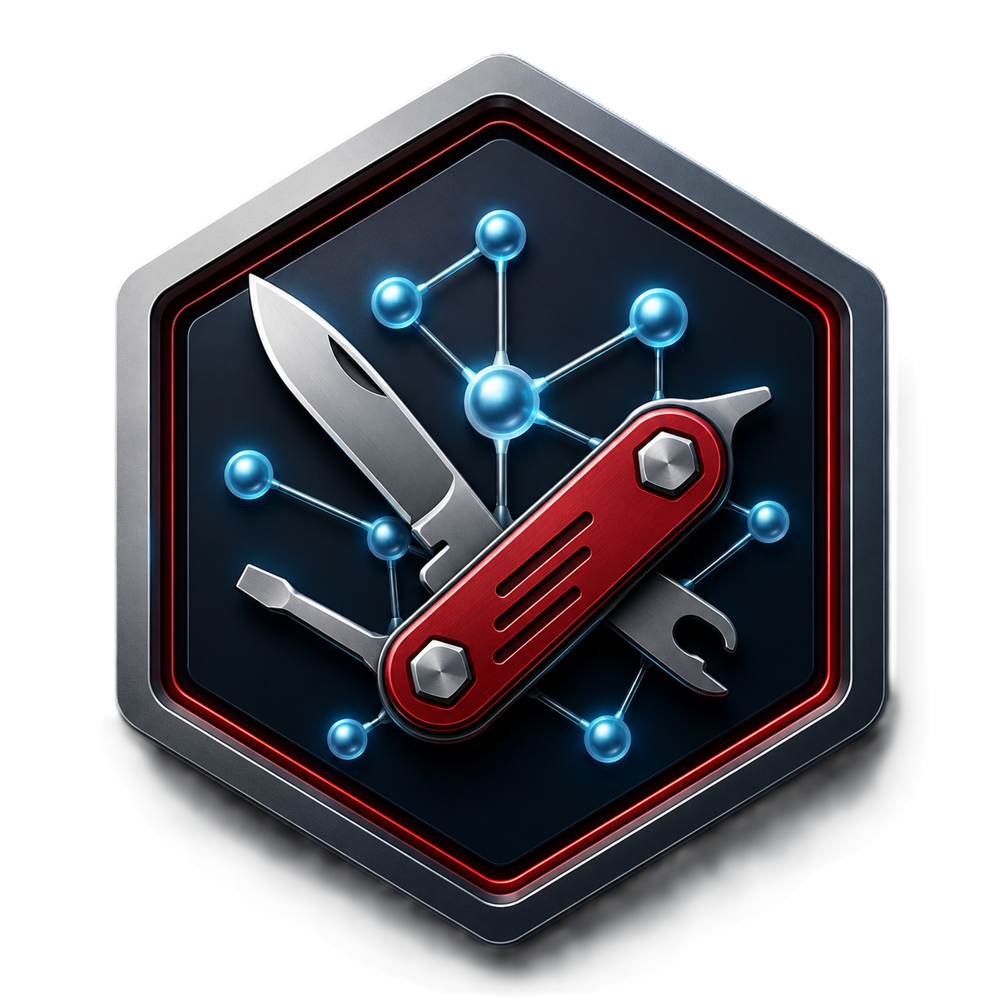
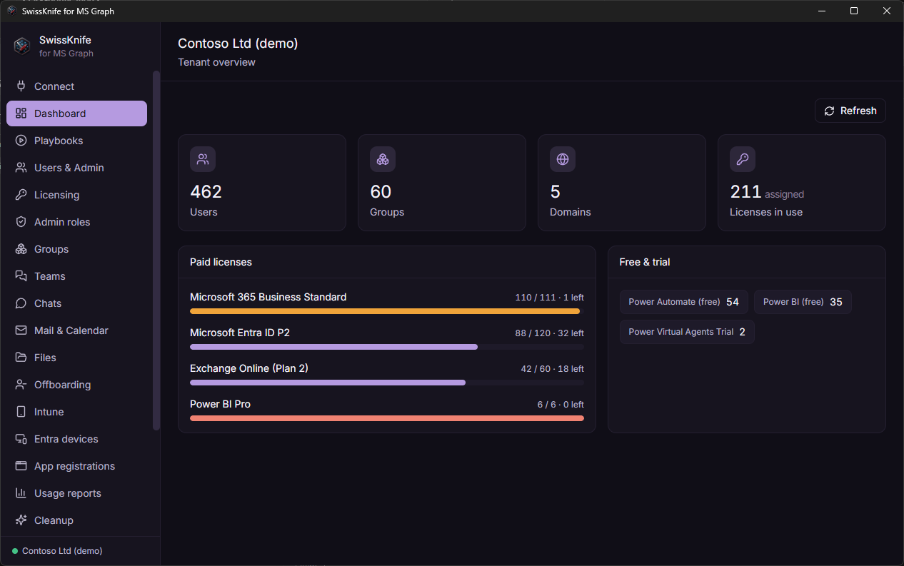
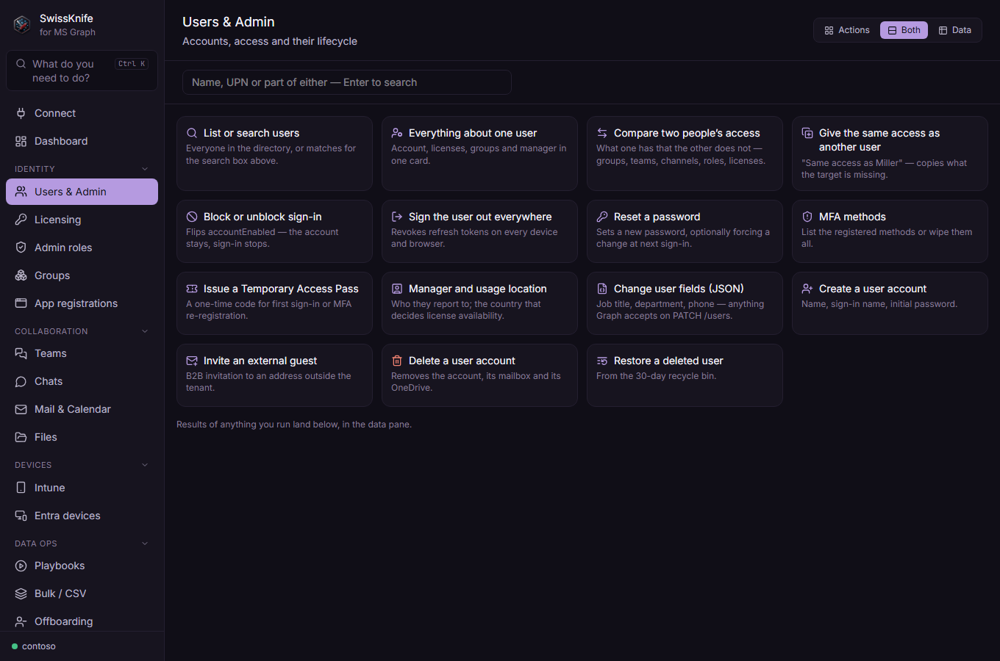
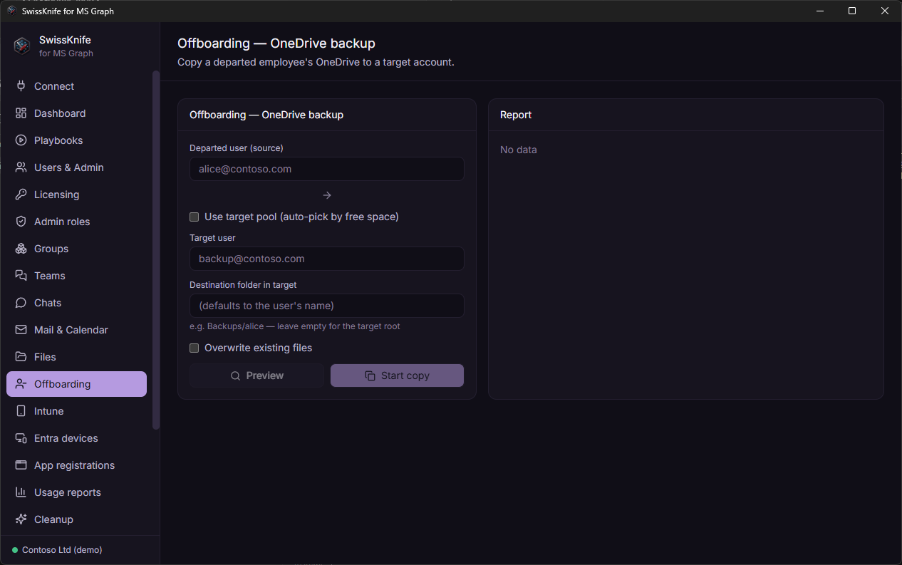
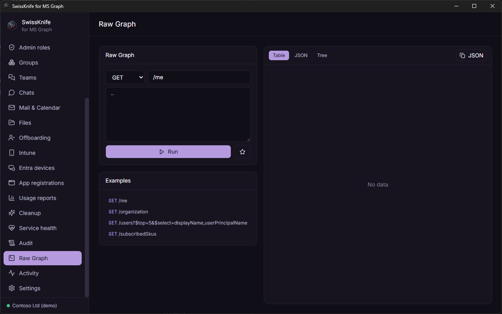

<h1 align="center">
  
</h1>

<p align="center">
  <b>SwissKnife for MS Graph</b> — a clean, fast Microsoft Graph desktop client for IT admins<br />
  <b>Wails · Go · React</b> · Windows · macOS · Linux
</p>

<p align="center">
  <a href="https://github.com/Nemu-x/SwissKnife-for-MS-Graph/releases">Releases</a> ·
  <a href="https://nemu-x.github.io/SwissKnife-for-MS-Graph/">Downloads</a> ·
  <a href="https://github.com/Nemu-x/SwissKnife-for-MS-Graph/wiki">Wiki</a> ·
  <a href="#support-the-project">Support</a>
</p>

<p align="center">
  
  
  
  
</p>

<p align="center">
  
</p>

---

## Overview

SwissKnife is a lightweight cross-platform desktop client for the Microsoft Graph API — built for IT administrators who prefer clean UI actions over bulky PowerShell scripts. One window gives you Entra ID, Teams, Chats, mail, OneDrive, SharePoint, Intune, devices, app registrations, licensing, storage cleanup, audit logs, usage reports, guided on/offboarding runbooks, and a raw Graph playground.

Everything is pick-by-name: users, groups, teams, channels, sites, roles, devices and chats load into searchable pickers, so you rarely type a raw ID.

Authentication is **app-only (client credentials)** or **delegated (device code)**. Secrets live only in the OS keychain, the access token never leaves the Go backend, and every write/destructive action is guarded by a typed confirmation and recorded in a local audit log.

## Features

- **Dashboard** — tenant overview: user/group/domain counts and license usage (paid vs free/trial, seats remaining)
- **Playbooks** — guided onboarding & offboarding runbooks that chain the individual actions into one reviewed flow
- **Users & Admin** — search, snapshot, create/update/delete, block/unblock, reset password, revoke sessions, manager, usage location, restore deleted users
- **Security** — reset MFA & list authentication methods, admin (directory) role assignment
- **Licensing** — tenant SKUs, per-user licenses, assign/remove
- **Teams / Groups / Chats** — channels, membership, Teamify, group & group-chat creation
- **Mail** — send email as any user (typed confirmation, audit-logged)
- **Files** — OneDrive & SharePoint browse, upload (large-file sessions), download, delete, sharing links
- **Offboarding** — copy a departed employee's OneDrive to a target account or an auto-picked backup pool (by free space), with preview, a live cancellable copy log that survives navigation, and a full report
- **Cleanup — reclaim space** — find duplicate files and version-history bloat across OneDrive & SharePoint (all document libraries), trim old versions or delete extras; optional per-site size scan sorts the biggest sites first
- **Devices** — Entra devices (enable/disable/delete) + BitLocker recovery keys, plus Intune (wipe/retire/lock)
- **App registrations** — inventory + expiring secret/certificate monitoring
- **Reports** — Microsoft 365 usage reports (CSV) · **Service health** & message center
- **Raw Graph** — GET/POST/PATCH/PUT/DELETE playground with history & favorites
- **Everywhere** — searchable pickers instead of raw IDs, results as master-detail / JSON / tree, CSV export, dark & light themes, custom accent color, English + Russian, read-only mode, in-app update check

## Screenshots

<table>
  <tr>
    <td width="50%"><br /><sub><b>Dashboard</b> — counts and license usage at a glance</sub></td>
    <td width="50%"><br /><sub><b>Users & Admin</b> — lifecycle, security, manager, licensing</sub></td>
  </tr>
  <tr>
    <td width="50%"><br /><sub><b>Offboarding</b> — OneDrive backup with preview & report</sub></td>
    <td width="50%"><br /><sub><b>Raw Graph</b> — request playground with history</sub></td>
  </tr>
</table>

## Downloads

Latest release — direct links (always point to the newest version):

| Platform | Download |
| --- | --- |
| Windows (x64, installer) | [SwissKnifeGraph-windows-amd64-installer.exe](https://github.com/Nemu-x/SwissKnife-for-MS-Graph/releases/latest/download/SwissKnifeGraph-windows-amd64-installer.exe) |
| Windows (x64, portable) | [SwissKnifeGraph-windows-amd64.exe](https://github.com/Nemu-x/SwissKnife-for-MS-Graph/releases/latest/download/SwissKnifeGraph-windows-amd64.exe) |
| macOS (universal) | [SwissKnifeGraph-macos-universal.zip](https://github.com/Nemu-x/SwissKnife-for-MS-Graph/releases/latest/download/SwissKnifeGraph-macos-universal.zip) |
| Linux (x64, tar.gz) | [SwissKnifeGraph-linux-amd64.tar.gz](https://github.com/Nemu-x/SwissKnife-for-MS-Graph/releases/latest/download/SwissKnifeGraph-linux-amd64.tar.gz) |
| Linux (x64, deb) | [SwissKnifeGraph-linux-amd64.deb](https://github.com/Nemu-x/SwissKnife-for-MS-Graph/releases/latest/download/SwissKnifeGraph-linux-amd64.deb) |
| Linux (x64, rpm) | [SwissKnifeGraph-linux-amd64.rpm](https://github.com/Nemu-x/SwissKnife-for-MS-Graph/releases/latest/download/SwissKnifeGraph-linux-amd64.rpm) |
| Arch (AUR) | `yay -S swissknife-graph-bin` |

Verify downloads against [`SHA256SUMS.txt`](https://github.com/Nemu-x/SwissKnife-for-MS-Graph/releases/latest/download/SHA256SUMS.txt), signed with minisign ([`.minisig`](https://github.com/Nemu-x/SwissKnife-for-MS-Graph/releases/latest/download/SHA256SUMS.txt.minisig), public key in [`minisign.pub`](minisign.pub)):

```bash
minisign -Vm SHA256SUMS.txt -P $(cat minisign.pub)
sha256sum -c SHA256SUMS.txt
```

macOS is unsigned for now — if blocked: `xattr -dr com.apple.quarantine SwissKnifeGraph.app`. Linux needs `webkit2gtk-4.1` + `gtk3` from your distro.

## Build from source

Prerequisites: **Go 1.26+**, **Node 22+**, and the [Wails CLI](https://wails.io) `v2.12`.

```bash
cd app
wails dev      # hot-reload development
wails build    # production binary → app/build/bin/
```

## Setup: Azure App Registration

You'll need a **Tenant ID**, **Client ID**, and (for app-only) a **Client Secret**, with Microsoft Graph **Application** permissions and admin consent — or use **device code** flow with delegated permissions. The full permission matrix per feature lives in the [Wiki](https://github.com/Nemu-x/SwissKnife-for-MS-Graph/wiki).

Minimal core-only set: `Directory.Read.All`, `User.Read.All`, `Group.ReadWrite.All`, `Team.ReadWrite.All`, `Files.ReadWrite.All`, `Sites.ReadWrite.All`, `AuditLog.Read.All`.

## Security

- Client secret is stored only in the OS keychain (Windows Credential Manager / macOS Keychain / Secret Service), never in plain text.
- The access token lives only in the Go backend and is never exposed to the web frontend.
- Destructive actions (wipe, retire, delete, reset password, send-as, remove role…) require a typed confirmation and are written to a local audit log.
- A global **read-only mode** blocks every write while you explore.

## Support the project

SwissKnife is free and MIT-licensed. If it saves you time, a crypto donation helps keep development and releases going. Thank you! 🗡️

| Asset | Address |
| --- | --- |
| USDT (TRC20) | `TPACN1kJRm2FnFF1cSqYtBnJwAmZ3qGMni` |
| USDT (Polygon / MATIC) | `0xD9333e859Fb74D885d22E27568589de61E4433b5` |
| BTC | `bc1qkkcgpqym967k2x73al6f7fpvkx52q4rzkut3we` |
| ETH | `0xD9333e859Fb74D885d22E27568589de61E4433b5` |

> Double-check the network before sending — wrong-network transfers are unrecoverable.

## Author

Built by **Nemu** — [github.com/Nemu-x](https://github.com/Nemu-x)
License: MIT
